# AI Interview Assistant

## Overview

AI Interview Assistant is a multi-agent AI application built using FastAPI and Google Gemini AI to automate interview preparation, candidate evaluation, resume analysis, and hiring recommendations.

The system simulates an AI-powered technical interviewer by generating interview questions, evaluating candidate answers, analyzing resumes against job descriptions, generating interview scorecards, and providing hiring recommendations.

Architecture
User
 │
 ▼
FastAPI APIs
 │
 ├── Authentication Layer
 │      ├── JWT
 │      ├── bcrypt
 │      └── SQLite + SQLAlchemy
 │
 ├── Gemini AI Agents
 │      ├── Question Generator
 │      ├── Interview Simulator
 │      ├── Resume Analyzer
 │      ├── Scorecard Generator
 │      └── Hiring Recommendation
 │
 ├── PDF Report Generator
 │
 ├── Logging
 │
 └── Global Exception Handler

## Features

- AI Interview Question Generator
- Answer Evaluation Agent
- Resume Skill Gap Analyzer
- Interview Scorecard Generator
- Hiring Recommendation Agent
- PDF Interview Report Generator
- Dockerized Deployment
- Swagger API Documentation

### Interview Question Generator

* Generates technical interview questions based on technology and experience level.
* Supports multiple domains such as Python, DevOps, AWS, Kubernetes, and more.

### Interview Generator

* Creates complete interview sessions dynamically using Gemini AI.

### Answer Evaluation Agent

* Evaluates candidate responses.
* Provides scores, feedback, and improvement suggestions.

### Resume Analyzer Agent

* Compares resumes against job descriptions.
* Identifies matched skills and missing skills.
* Generates skill-gap analysis.

### Scorecard Generator Agent

* Generates interview scorecards based on:

  * Question
  * Candidate Answer
  * Feedback
* Produces:

  * Overall Score
  * Technical Knowledge Score
  * Communication Score
  * Problem Solving Score
  * Recommendation

### Hiring Recommendation Agent

* Uses resume analysis and interview scorecards.
* Produces:

  * Hiring Decision
  * Candidate Strengths
  * Areas of Concern
  * Final Recommendation

## Tech Stack

* Python
* FastAPI
* Google Gemini AI
* Pydantic
* SQLAlchemy
* SQLite
* JWT Authentication
* bcrypt Password Hashing
* REST APIs
* Uvicorn
* Docker

## API Endpoints

* POST /generate-questions
* POST /generate-interview
* POST /evaluate-answer
* POST /analyze-resume
* POST /generate-scorecard
* POST /generate-recommendation
* POST /generate-report
* POST /register
* POST /login
* GET  /profile

## Authentication & Security

- JWT Token Authentication
- Password Hashing using bcrypt
- SQLite User Database
- SQLAlchemy ORM
- Protected Profile Endpoint
- Environment Variable Based Secret Key

## Monitoring & Observability

- Application Logging
- User Registration Tracking
- Login Activity Tracking
- Global Exception Handling

## Deployment

- Dockerized Application
- FastAPI REST APIs
- Swagger Documentation
- SQLite Database

## Screenshots

### Swagger UI
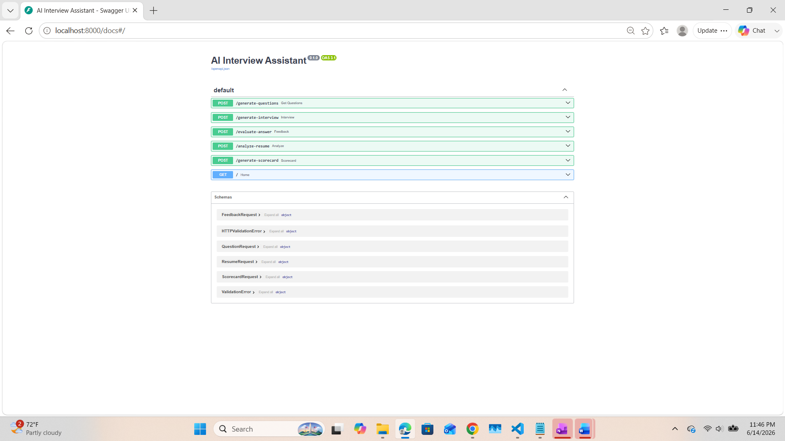

### Question Generation
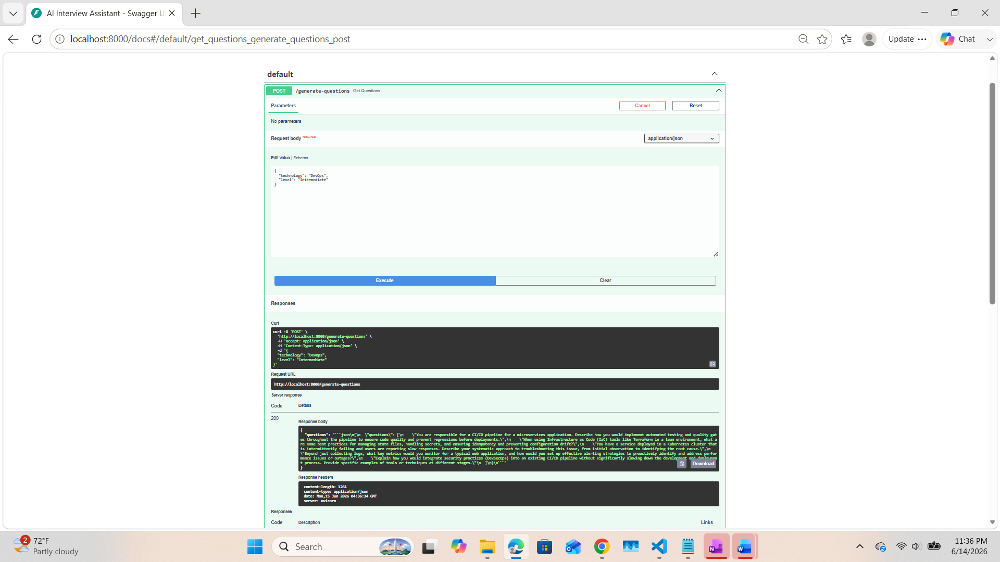

### Interview Generation
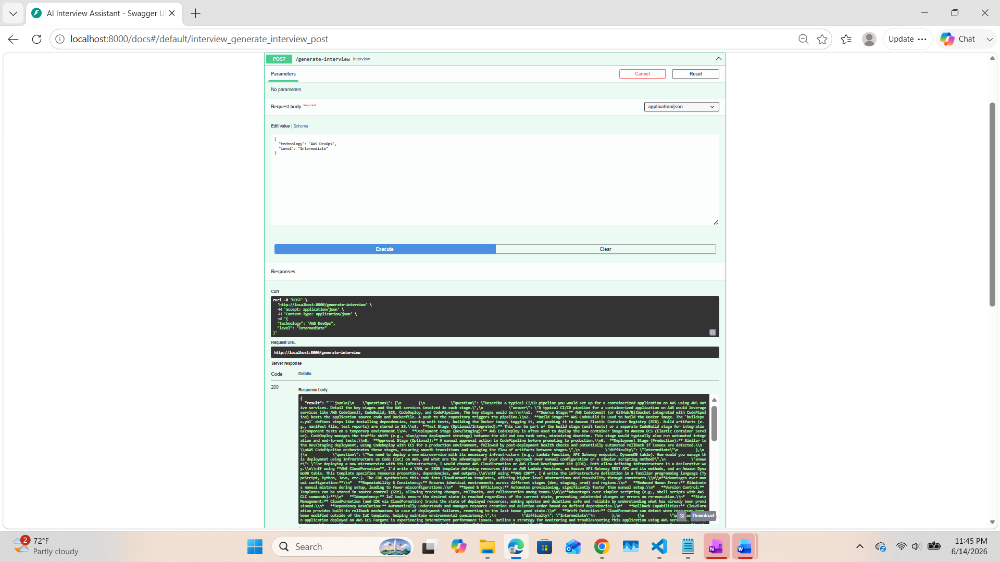

### Answer Evaluation
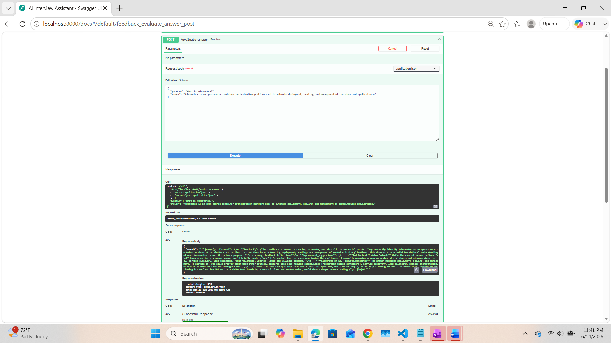

### Resume Analysis
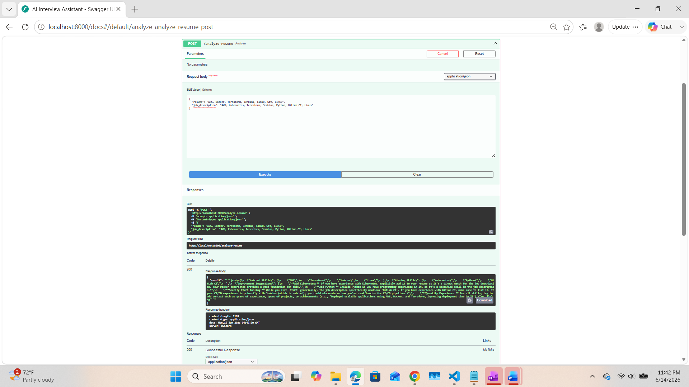

### Scorecard Generation
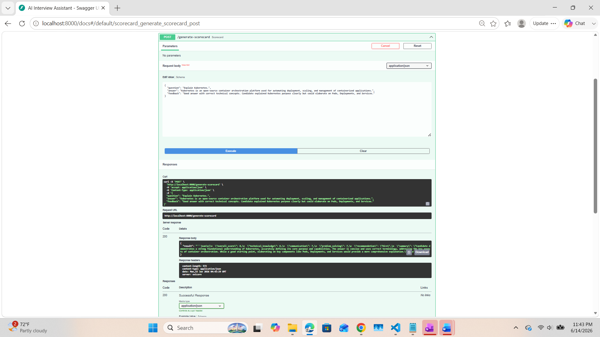

### Hiring Recommendation
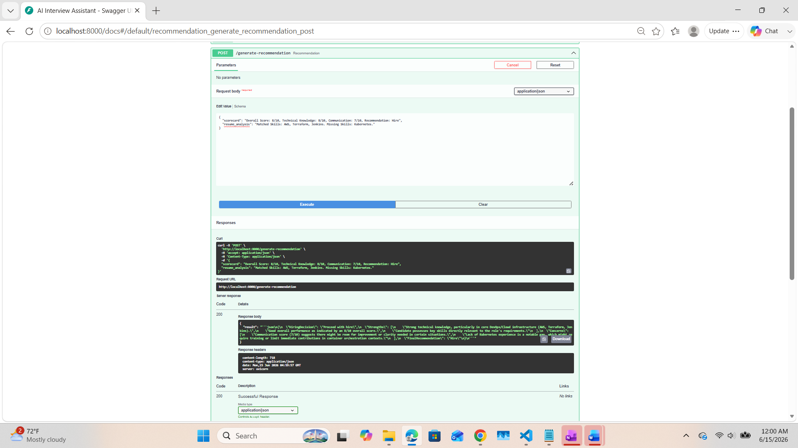

### PDF Report Generation API
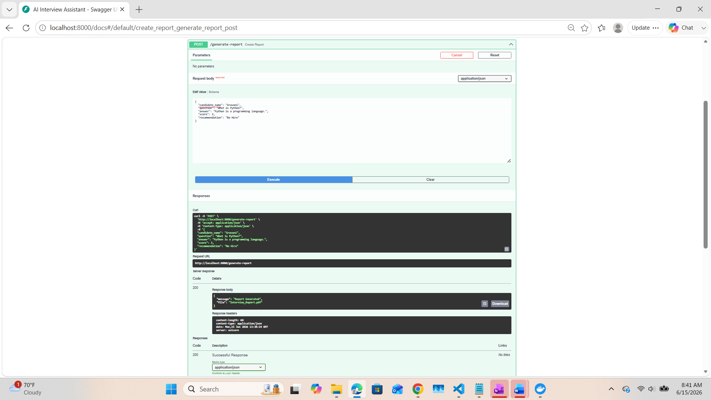

### Generated PDF Report
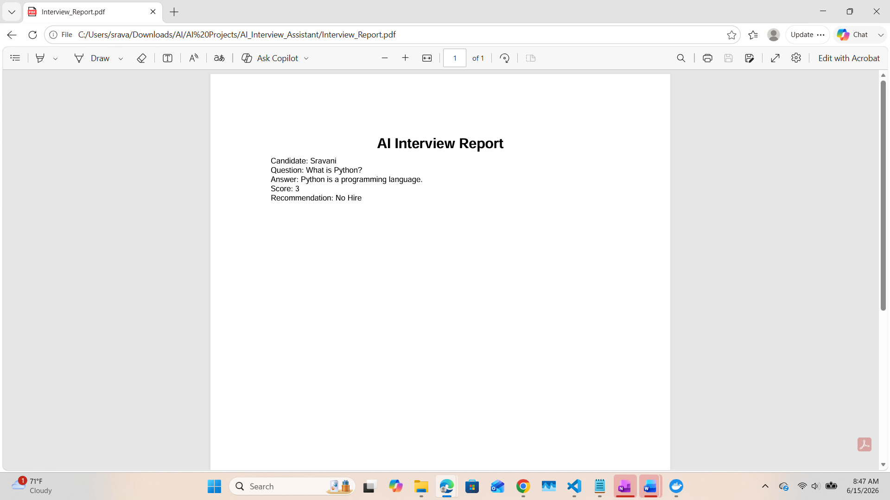

### User Registration
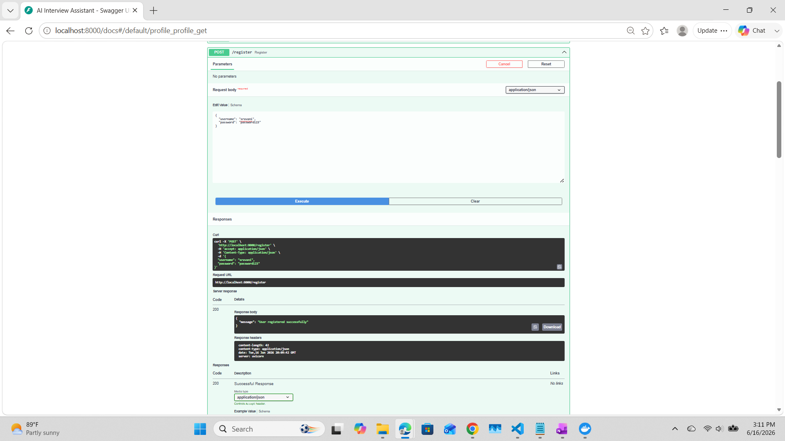

### User Login (JWT Authentication)
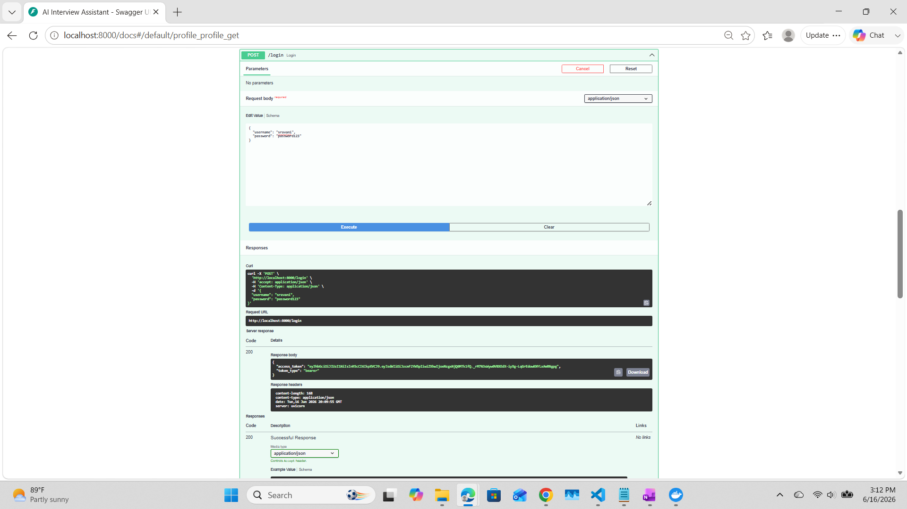

### Protected Profile Endpoint
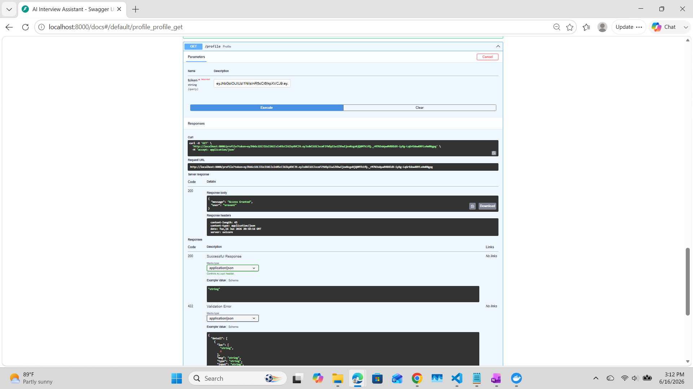

## Key Achievements

- Built 9 REST APIs using FastAPI
- Implemented JWT Authentication & Authorization
- Secured user passwords using bcrypt hashing
- Integrated Google Gemini AI for interview simulation
- Generated automated PDF Interview Reports
- Implemented SQLite database using SQLAlchemy ORM
- Added centralized logging and exception handling
- Dockerized application for deployment

## Docker Setup

Build Docker Image

```bash
docker build -t ai-interview-assistant .
```

Run Docker Container

```bash
docker run -p 8000:8000 --env-file .env ai-interview-assistant
```

Swagger Documentation

```text
http://localhost:8000/docs
```


